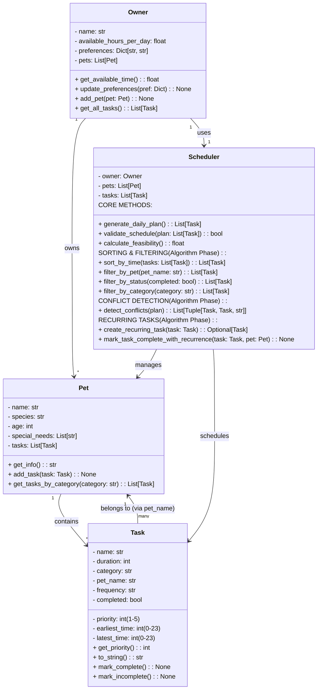
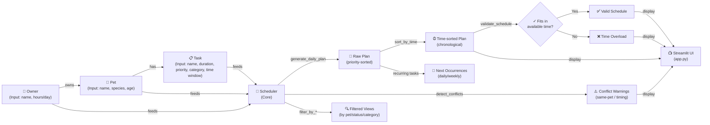
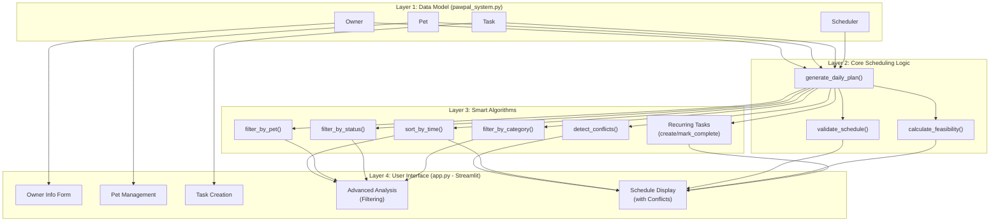

# PawPal+ Final System Architecture (UML)

## Complete Class Diagram with Algorithms

## Data Flow Diagram

## System Layers

## Key Design Patterns

### 1. Session State Management (Streamlit)
- **Pattern**: Dictionary-based vault in `st.session_state.owner`
- **Purpose**: Persist Owner object across Streamlit reruns
- **Code**: `if "owner" not in st.session_state: create else: use`

### 2. Validation via Post-Init
- **Pattern**: Dataclass `__post_init__()` method
- **Purpose**: Validate Task attributes (priority 1-5, positive duration, valid time ranges)
- **Benefit**: Catch invalid data early before scheduling

### 3. Algorithmic Separation
- **Pattern**: Distinct methods for each algorithm (sort, filter, detect, recur)
- **Purpose**: Enable UI to call different algorithms without tight coupling
- **Benefit**: Easy to test, extend, and compose

### 4. Conflict Messaging
- **Pattern**: Return tuples with (task1, task2, message) including severity
- **Purpose**: Distinguish same-pet conflicts (impossible) from timing conflicts (owner decision)
- **Benefit**: UI can display different warnings appropriately

---

## Evolution Summary

| Phase | Key Additions | Impact |
|-------|---------------|--------|
| **Phase 1** | 4 core classes (Owner, Pet, Task, Scheduler) | Foundation for all logic |
| **Phase 2** | pet_name binding, time windows, validation | Prevents invalid schedules |
| **Phase 3** | generate_daily_plan, validate, feasibility | Core scheduling works |
| **Phase 4** | 7 algorithms (sort, filter×3, detect_conflicts, recurring) | Smart, composable scheduling |
| **Phase 5** | UI integration, test suite, algorithmic display | User-facing smart features |
